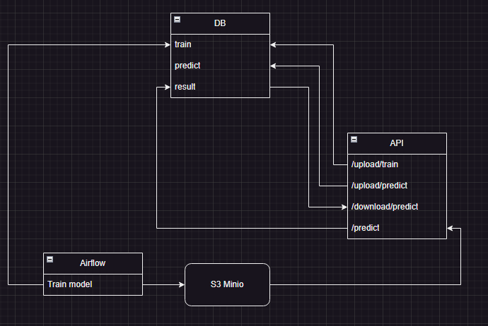

## This is a demo pypline 



#### Done
- API with the ability to load data from CSV to Postgres
- TensorFLow ML model
- The model is trained in Airflow with saving to S3 Minio. The model uses CPU for learning.
- Predict pipeline with loading from S3. Results will be saved in DB. You can download them in CSV.
- docker-compose is used to run all services. It is made on Airflow sample script

#### TODO
- Split train to stages: get data >> prepare >> learn and save model
- Selection of model versions for predictions
- SQLAlchemy data models
- Errors monitoring and processing

#### First launch
Airflow database initialising
```shell
docker-compose up airflow-init
```

#### Run services
```shell
docker-compose up
```

#### Train and predict data loading into API
Old data will be overwritten every data load

<http://0.0.0.0:8081/>


#### Run model training in Airflow
Data will save in Airflow
Login `airflow`
Password `airflow`

<http://0.0.0.0:8080/>


#### Model will be saved in Minio
Login `minio`
Password `miniopass`

<http://0.0.0.0:9001/>


#### Predict
После можно запустить predict через API и скачать результаты. Из Minio будет выгружена последняя загруженная модель, 
данные будут сохранены в БД, могут быть выгружены в CSV через API
Now you can run predict in API and download results. Last model version will be downloaded from Minio. 
Predictions will be saved in DB and can be loaded from API to CVS